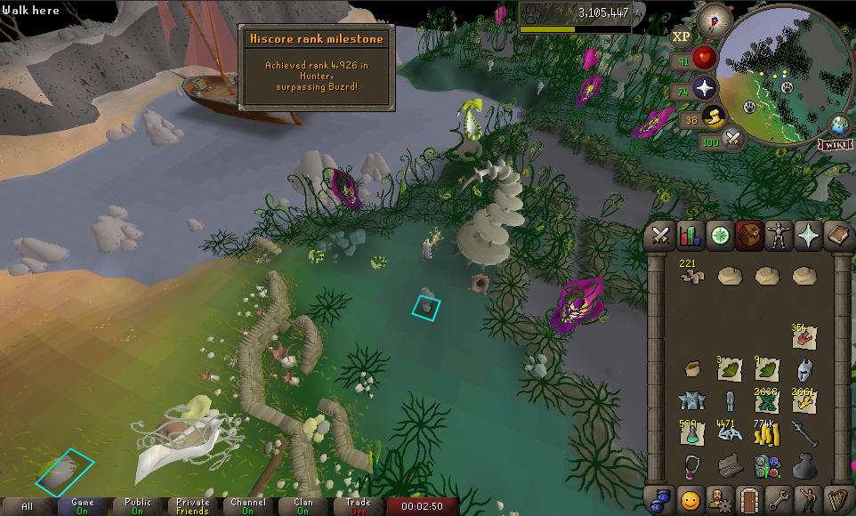

# Hiscore Notifications
Gives a leagues style notification to the player when they achieve certain milestones on the OSRS hiscores.

## Credit:
Huge credit to Antimated for their original plugin [Milestone Levels](https://github.com/Antimated/milestone-levels)!
Hiscore Notifications builds off of the great work that was done in Milestone Levels.
For customizable notifications at XP, Level, and Virtual Level intervals, check out that plugin instead of this one.

## Features:
* Get notified when ranking up on the OSRS leaderboards.
* Choose which leaderboard to use (Normal, Ironman, Hardcore Ironman, Ultimate Ironman).
* Enable or disable notifications for any skills.
* Customize the notification message when gaining hiscore ranks.

## Note:
This plugin is not enabled on a skill until you reach level 60. The leaderboards at low levels are too densely 
populated. This would result in notification spam, and spammed requests to Jagex's hiscores page, which should be avoided.

## Screenshot:

