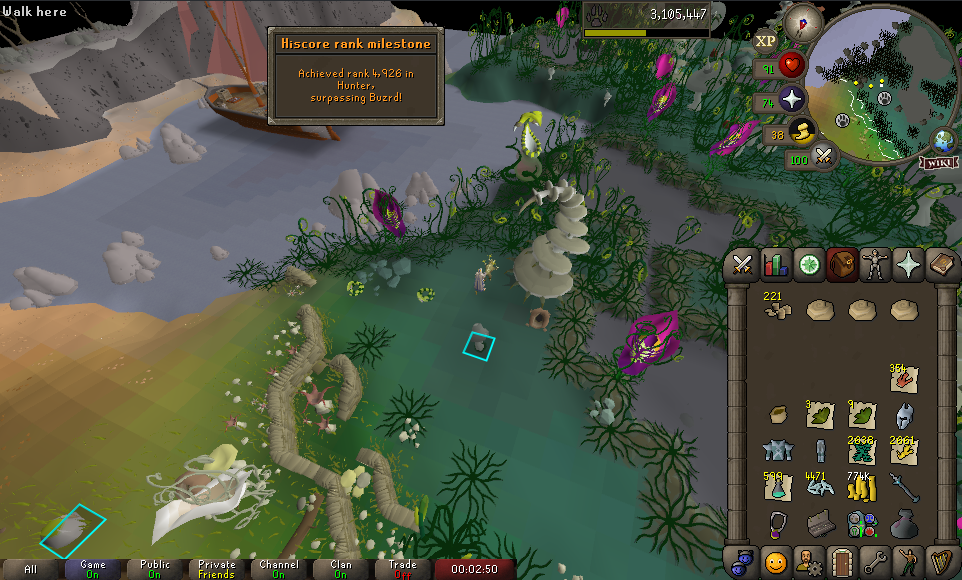

# Hiscore Notifications
Gives a leagues style notification to the player when they achieve certain milestones on the OSRS hiscores.

## Credit:
Huge credit to Antimated for their original plugin [Milestone Levels](https://github.com/Antimated/milestone-levels)!
Hiscore Notifications builds off of the great work that was done in Milestone Levels.
For customizable notifications at XP, Level, and Virtual Level intervals, check out that plugin instead of this one.

## Features:
* Get notified when ranking up on the OSRS leaderboards.
* Choose which leaderboard to use (Normal, Ironman, Hardcore Ironman, Ultimate Ironman, etc.).
* Customize how often you should be notified about leaderboard ranks by setting rank intervals.
* Enable or disable notifications for any skills.
* Customize the notification message when gaining hiscore ranks.

## Notes:
This plugin is not enabled on a skill until you reach level 60. The leaderboards at low levels are too densely 
populated. This would result in notification spam, and spammed requests to Jagex's hiscores page, which we are
trying to avoid.

This plugin only starts gathering hiscore data about skills after gaining XP in the respective skill, and only
starts tracking boss KC after your first KC of the session. This is another safeguard that exists to prevent
sending too many requests to the hiscore servers. Because of this, notifications are not available until your
second KC or a little while after you start gaining XP for a skill. 

## Screenshot:

